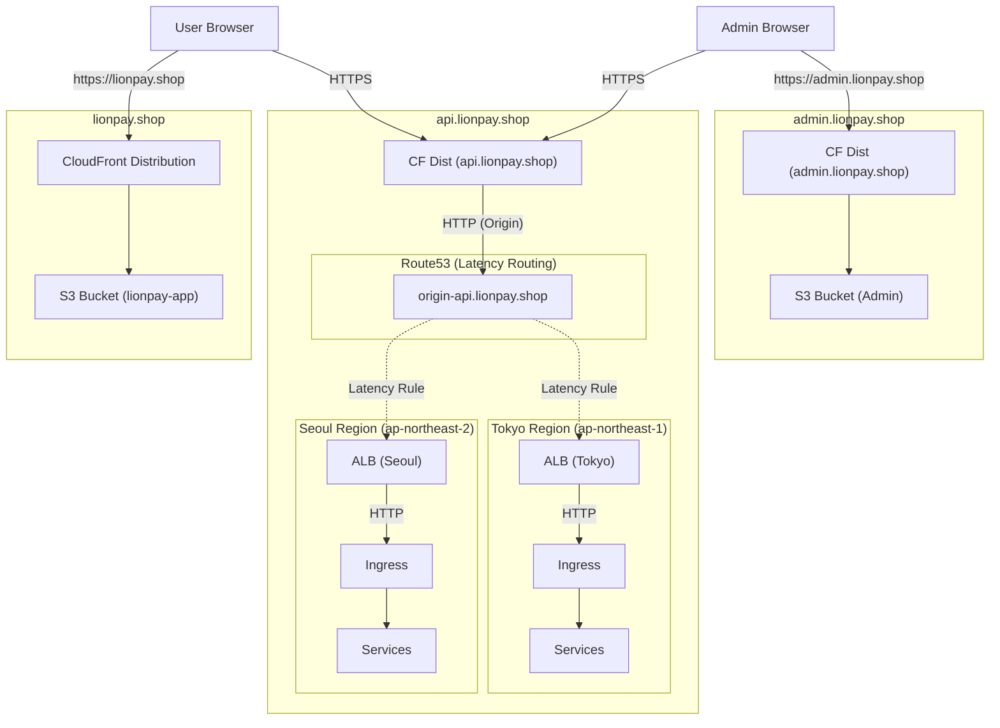

# LionPay 배포 아키텍처 가이드 (Subdomain + Multi-Region)

사용자의 요청에 따라 **API 서버를 별도 서브도메인(`api.lionpay.shop`)으로 분리**하고, **서울/도쿄 리전의 EKS 클러스터로 트래픽을 분산**하는 아키텍처 가이드입니다.

- **Frontend**: `https://lionpay.shop` (Global CloudFront)
- **Backend API**: `https://api.lionpay.shop` (Global CloudFront -> Route53 Latency -> Seoul/Tokyo ALB)
- **Management (Admin)**: `https://admin.lionpay.shop` (Global CloudFront)

### 인프라 리소스 요약

총 **3개의 CloudFront Distribution**과 **Multi-Region 백엔드**가 필요합니다.

1. **lionpay.shop** (Frontend)
2. **admin.lionpay.shop** (Admin)
3. **api.lionpay.shop** (Backend API)



---

## 1. CloudFront + Multi-Region ALB 아키텍처

**Route53의 Latency Routing**을 사용하여 사용자와 가까운 리전(서울 또는 도쿄)의 클러스터로 연결합니다. CloudFront는 HTTPS를 처리하고, 백엔드와는 HTTP로 통신합니다.

### 1.1 Origin Domain 주소 생성 (`origin-api.lionpay.shop`)

CloudFront가 ALB를 바라볼 때, 단일 ALB 주소가 아닌 **Route53의 Latency 레코드**를 바라봐야 합니다.

- **Route53 호스팅 영역**: `lionpay.shop`
- **레코드 생성**:
  - **Name**: `origin-api.lionpay.shop`
  - **Type**: A (Alias)
  - **Routing Policy**: **Latency**
  - **Record 1 (Seoul)**: Region `ap-northeast-2`, Target `ALB-Seoul-DNS`
  - **Record 2 (Tokyo)**: Region `ap-northeast-1`, Target `ALB-Tokyo-DNS`

### 1.2 CloudFront 설정 (for `api.lionpay.shop`)

1. **Distribution 생성**:
    - **Alternate Domain Names**: `api.lionpay.shop`
    - **Certificate**: ACM (`us-east-1` 리전 필수)

2. **Origin 설정**:
    - **Origin Domain**: `origin-api.lionpay.shop` (위에서 생성한 Latency Routing 도메인)
    - **Protocol**: **HTTP Only** (CloudFront <-> ALB 구간은 HTTP 80)
    - **SSL**: 비활성화 (백엔드가 HTTP이므로)

3. **Behavior 설정**:
    - **Viewer Protocol Policy**: `Redirect HTTP to HTTPS`
    - **Allowed Methods**: `GET, HEAD, OPTIONS, PUT, POST, PATCH, DELETE`
    - **Cache Policy**: `CachingDisabled`
    - **Origin Request Policy**: `AllViewerExceptHostHeader`
        - *설명*: Host 헤더는 `origin-api.lionpay.shop`으로 전달될 수 있습니다. ALB Ingress 설정 시 Host 규칙에 주의하세요.

---

## 2. Kubernetes Ingress 설정 (서울/도쿄 공통)

각 리전의 EKS 클러스터에 동일하게 적용합니다. CloudFront가 HTTPS를 처리하므로 **HTTP(80)**만 오픈합니다.

```yaml
apiVersion: networking.k8s.io/v1
kind: Ingress
metadata:
  name: lionpay-ingress
  namespace: lionpay
  annotations:
    kubernetes.io/ingress.class: alb
    alb.ingress.kubernetes.io/scheme: internet-facing
    alb.ingress.kubernetes.io/target-type: ip

    # [설정] SSL 없음, HTTP(80) 리스너만 사용
    alb.ingress.kubernetes.io/listen-ports: '[{"HTTP":80}]'
    alb.ingress.kubernetes.io/backend-protocol: HTTP

    # [중요] Health Check 설정 (Latency Routing 동작을 위해 필수)
    alb.ingress.kubernetes.io/healthcheck-path: /api/v1/auth/ping
    alb.ingress.kubernetes.io/success-codes: '200'
spec:
  rules:
    # Host 규칙: CloudFront Origin 설정에 따라 들어오는 Host 헤더가 다를 수 있음.
    # 안전하게 Host 규칙을 제거하거나, origin-api.lionpay.shop을 추가.
    - http:
        paths:
          - path: /api/v1/auth
            pathType: Prefix
            backend:
              service:
                name: auth-service
                port:
                  number: 8080
          - path: /api/v1/wallet
            pathType: Prefix
            backend:
              service:
                name: wallet-service
                port:
                  number: 8080
```

---

## 3. CORS (Cross-Origin Resource Sharing) 설정 **(필수)**

`api.lionpay.shop` 도메인과 `lionpay.shop`(메인), `admin.lionpay.shop`(어드민)이 다르므로 CORS 허용이 필수입니다.

### 3.1 LionPay Auth (Spring Boot)

`SecurityConfig.java`:

```java
configuration.setAllowedOrigins(Arrays.asList(
    "https://lionpay.shop",
    "https://admin.lionpay.shop",
    "http://localhost:5173",
    "http://localhost:5174"
));
configuration.setAllowCredentials(true);
```

### 3.2 LionPay Wallet (.NET)

`Program.cs`:

```csharp
corsBuilder.WithOrigins(
        "https://lionpay.shop",
        "https://admin.lionpay.shop",
        "http://localhost:5173",
        "http://localhost:5174"
    )
    .AllowCredentials();
```

---

## 4. 프론트엔드 배포 및 환경변수 설정

빌드 시 API URL을 `https://api.lionpay.shop`으로 설정합니다. 사용자는 이 주소로 요청을 보내고, CloudFront와 Route53이 가장 가까운 서울/도쿄 리전으로 연결해줍니다.

**Frontend Build (.env)**:

```bash
AUTH_SERVICE_URL=https://api.lionpay.shop
WALLET_SERVICE_URL=https://api.lionpay.shop
```
